# 第五章：Google 翻译背后的黑科技：神经网络和序列到序列学习

作者：[Adam Geitgey](http://link.zhihu.com/?target=https%3A//medium.com/%40ageitgey%3Fsource%3Dpost_header_lockup)

原文：[https://medium.com/@ageitgey/machine-learning-is-fun-part-5-language-translation-with-deep-learning-and-the-magic-of-sequences-2ace0acca0aa\#.223irmdz0](http://link.zhihu.com/?target=https%3A//medium.com/%40ageitgey/machine-learning-is-fun-part-5-language-translation-with-deep-learning-and-the-magic-of-sequences-2ace0acca0aa%23.223irmdz0)

译者：巡洋舰科技——赵 95

翻译原文：<https://zhuanlan.zhihu.com/p/24339995>

校对：离线Offline——林沁

转载请联系译者。

我们都知道[Google 翻译](http://link.zhihu.com/?target=https%3A//translate.google.com/)，也都喜欢用它。这个网站可以魔术般瞬时翻译 100 种不同的人类语言。它甚至存在于我们的手机和智能手表上（[如图](http://link.zhihu.com/?target=https%3A//cdn-images-1.medium.com/max/1600/1%2Aq_xg5WYxXL2HCHY5k8xVGg.gif)）。

Google 翻译背后的技术被称为机器翻译。它改变了世界，让本来根本不可能相互交流的人能彼此沟通。

但我们都知道，在过去的 15 年里，高中生们也开始用 Google 翻译……呃 ……**协助**他们完成西班牙语作业。这已经不是新闻了……？

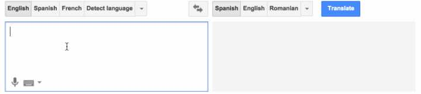

事实证明，在过去两年，深度学习已经完全改写了我们的机器翻译方法。那些对语言翻译一无所知的深度学习研究人员正在利用一个个相对简单的机器学习解决方案，来打败世界上最好的专家建造的语言翻译系统。

这一突破背后的技术被称为**序列到序列学习**（sequence to sequence learning）。这是一项非常强大的技术，能解决许多种类的问题。在我们看到它如何被用于翻译之后，我们还将学习这个算法是怎样用来编写 AI 聊天机器人和描述图片的。

我们开始吧！

## 让计算机翻译

那么我们该如何编写代码，才能让计算机翻译人类的语言呢？

最简单的方法，就是把句子中的每个单词，都替换成翻译后的目标语言单词。这里有一个简单的例子，把西班牙语逐字翻译成英语：

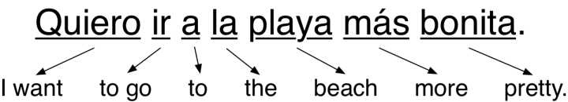

我们只是用匹配的英语单词替换每个西班牙单词。

这很容易实现，因为你所需要是一本字典来查找每个单词的翻译。但结果并不好，因为它忽略了语法和上下文的联系。

因此，下一件你可能要做的事，就是开始添加特定语言规则以改进结果。例如，你可能将两个常用词翻译为词组。你可能互换名词和形容词的顺序，因为他们在西班牙语中以相反的顺序出现：

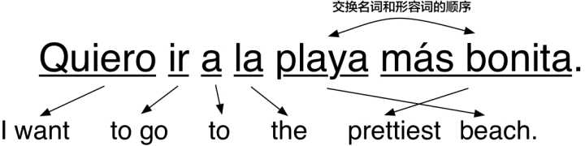

这真的有效！如果我们继续添加更多的规则，直到我们可以应对每一部分语法，我们的程序应该就能够翻译任何句子了，对吧？

这就是最早的机器翻译系统的工作原理。语言学家提出了许多复杂的规则，并逐一编程实现。一些世界上最聪明的语言学家在冷战期间辛勤努力了多年，才[创建出了一些翻译系统](http://link.zhihu.com/?target=https%3A//en.wikipedia.org/wiki/Georgetown%25E2%2580%2593IBM_experiment)来理解俄罗斯人之间的交流。

不幸的是，这种套路只对简单问题适用，比如说像天气预报这样结构简单的文档。它对于真实世界的文字来说并不可靠。

问题是，人类语言并不总是遵循固定的规则。人类语言充满了各种特殊情况，区域之间表达也有差异，或者有人干脆就不按套路出牌。我们今天的英语语法，更多是[受数百年前侵略者的影响](http://link.zhihu.com/?target=https%3A//en.wikipedia.org/wiki/History_of_English%23Middle_English)形成的，而不是由某个人坐下来制定的。

## 利用统计数据使计算机更好地翻译

在基于规则的系统失效之后，研究者基于概率和统计的模型而不是语法规则，开发出了一些新的翻译方法。

建造一个基于统计数据的翻译系统需要大量的训练数据，其中完全相同的文本被翻译成至少两种语言。这种双重翻译的文本称为**平行语料库**（parallel corpora）。18 世纪的科学家以同样的方式在[罗塞塔石碑](http://link.zhihu.com/?target=https%3A//en.wikipedia.org/wiki/Rosetta_Stone)上面从希腊语中解读出埃及象形文字的意义\[1\]。以同样的方式，计算机可以使用平行语料库猜测如何将文本从一种语言转换为另一种语言。

幸运的是，已经有许多文本被同时翻译为两种语言。例如，欧洲议会将其诉讼程序翻译成了 21 种语言。因此，研究人员经常使用[这些数据](http://link.zhihu.com/?target=http%3A//www.statmt.org/europarl/)来帮助建造翻译系统。

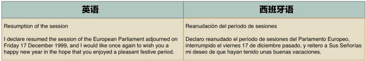

训练数据通常令人兴奋！但这只是无数条干巴巴的政府文件而已……

**用概率的思维思考**

统计翻译系统的根本不同，在于它们试图生成的翻译不止一种。相反，它们会生成成千上万种可能的翻译，然后按照正确率给这些翻译排序。它的正确程度是由与训练数据的相似程度决定的。以下是它的工作原理：

**第一步：将原始句子分成块**

首先，我们将我们的句子分成简单的块，每一块都可以轻松翻译：

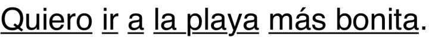

**第二步：找到每一块的所有可能的翻译**

接下来，通过寻找数据库中所有人类翻译过的相同词块，我们把每个词块可能的译法都列出来。

要着重注意的是，我们不只是在一本简简单单的翻译字典中查找这些词块。相反，我们看到的是真实的人如何在真实的句子中把这些词块翻译出来。这有助于我们捕获到词块在不同语境中所有不同的表达方式：

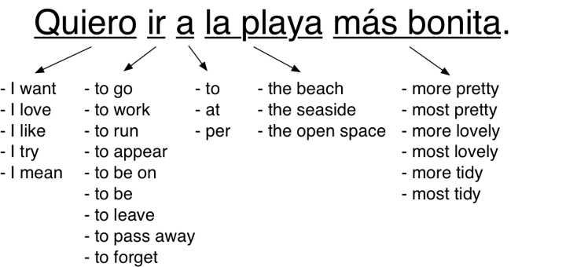

即使最常见的短语也有很多种可能的译法。

这些可能的翻译中，有些译法出现的频率可能会远高于其他译法。根据每种译法出现的频率，我们可以给它们设定一个分数。

例如，「Quiero」更多的时候是指「我想要」（I want）而不是「我试着」（I try）。所以，根据 「Quiero」在训练数据中被翻成「我想要」的频率，我们可以给「我想要」这个译法更多的权重。

**第三步：生成所有可能的句子，找到最有可能的那句**

接下来，把这些词块每种可能的译法组合起来，我们可以生成一堆可能的句子。

仅仅把第二步中我们列出的词块译法组合起来，我们就可以生成将近 2500 句不同的句子。下面是一些例子：

> I love \| to leave \| at \| the seaside \| more tidy.
>  
> I mean \| to be on \| to \| the open space \| most lovely.
>  
> I like \| to be \|on \| per the seaside \| more lovely.
>  
> I mean \| to go \| to \| the open space \| most tidy.

  

但在真实世界的系统中，因为有不同的语序和词块分解方法，所以实际上有更多可能的词块组合：

> I try \| to run \| at \| the prettiest \| open space.
>
> I want \| to run \| per \| the more tidy \| open space.
>
> I mean \| to forget \| at \| the tidiest \| beach.
>
> I try \| to go \| per \| the more tidy \| seaside.

  

现在我们需要扫描所有这些生成的句子，找到那句听起来「最像人话」的句子。

为此，我们将每个生成的句子与来自英语书籍和新闻故事的数百万个真实句子进行比较。我们拥有的英语文本越多越好。

我们可能会得到这种翻译：

> I try \| to leave \| per \| the most lovely \| open space.

  

很可能没有人用英语写过这样的句子，所以我们的数据库中，应该没有和它非常相似的句子。我们会给这个可能的译法设定一个低概率的得分。

但看看下面这个可能的翻译：

> I want \| to go \| to \| the prettiest \| beach.

  

这个句子和我们的训练集中的句子很类似，所以它将获得一个高概率的得分。

在尝试过所有可能的句子之后，我们会选择那个既包含了最有可能的词块译法，又与真实英语表达最相似的句子。

我们最后的翻译将是「I want \| to go \| to \| the prettiest \| beach.」不错！

**有里程碑意义的统计机器翻译**

当有足够多的训练数据的时候，统计机器翻译系统的性能要优于基于语言规则的系统。[弗伦茨·约瑟夫·奥赫](http://link.zhihu.com/?target=https%3A//en.wikipedia.org/wiki/Franz_Josef_Och)（Franz Josef Och）基于这些想法并做出了改进，并在 21 世纪初使用它们构建了 Google 翻译。机器翻译终于可以被全世界使用。

早期的时候，基于概率翻译的「愚蠢」方法居然比语言学家设计规则系统做得更好，这让每个人都感到惊讶。这导致了八十年代的时候，研究人员会（有点刻薄地）说：

> 「每当我炒了一个语言学家鱿鱼的时候，我的翻译准确度就会上升。」——
> [弗雷德里克·耶里内克](http://link.zhihu.com/?target=https%3A//en.wikipedia.org/wiki/Frederick_Jelinek)
> （Frederick Jelinek）

  

**统计机器翻译的局限性**

虽然统计机器翻译系统效果还不错，但是它们难于构建和维护。每一对需要翻译的新语言，都需要专业人士对一个全新的多步骤翻译流水线进行调试和修整。

因为构建这些不同的流水线需要做太多工作，所以我们必须进行权衡。如果你要用 Google 翻译把格鲁吉亚语翻译成泰卢固语（印度东部德拉维拉语言），那么作为一个中间步骤，它必须先翻译成英语。因为没有太多格鲁吉亚到泰卢固语的翻译需求，所以在这一对语言上投入太多并没有太大意义。相比于英语翻译到法语，它可能会使用一个更低级的翻译流水线。

如果我们能让计算机为我们做所有令人讨厌的开发工作，这不更好么？

## 让电脑翻译得更好——无需昂贵的专家们

机器翻译的核心是一个黑盒系统，它通过查看训练数据，自己就可以学习如何翻译。使用统计机器翻译，人们仍然需要建立和调整多步骤的统计模型。

2014 年，[KyungHyun Cho 的团队取得了突破](http://link.zhihu.com/?target=http%3A//arxiv.org/abs/1406.1078)。他们发现了一种应用深度学习来构建这种黑盒系统的方法。他们的深度学习模型采用了平行语料库，并使用这个语料库让机器在无任何人为干预的情况下来学习如何在这两种语言之间进行翻译。

两个宏伟的方法使这成为可能——循环神经网络和编码。通过巧妙地结合这两个想法，我们可以建立一个能够自学的翻译系统。

**循环神经网络**

我们已经在第二章讨论过了循环神经网络，让我们快速回顾一下。

一个常规（非循环）神经网络是一个泛型机器学习算法——接收一序列数字，并（基于先前的训练）计算出结果。神经网络可以被看作一个能解决很多问题的黑盒子。例如，我们可以基于房子的属性，使用神经网络来计算房屋的近似价格：

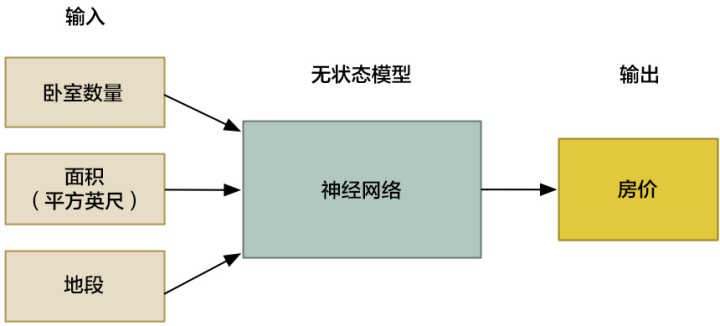

但是像大多数机器学习算法一样，神经网络是无状态的（stateless）。你输入一序列数字，神经网络计算并输出结果。如果再次输入相同的数字，它总是计算出相同的结果。它没有进行过的计算的记忆。换句话说，2 + 2 总是等于4。

一个**循环神经网络**（Recurrent Neural Network 或简称 RNN）是一个稍微改进过的神经网络的版本，区别是 RNN 先前的状态是可以被当做输入，再次带入到下一次计算中去。这意味着之前的计算结果会更改未来计算的结果！

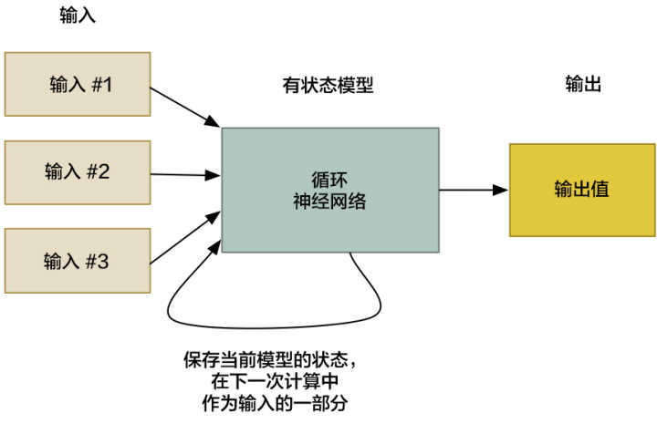

人类痛恨他：一个黑科技就让机器变得更聪明！

我们为什么要这样做？无论我们上次计算结果是什么，2 + 2 不应该总是等于 4 么？

这个技巧允许神经网络学习一系列数据中的规律。例如，基于句子的前几个词，你可以使用它来预测句子中下一个最有可能的单词是什么：

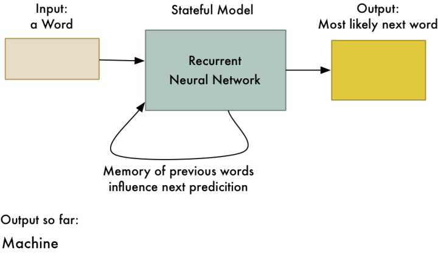

实现智能手机输入法的「自动更正」的方法之一

**当你想要学习数据中的规律时，RNN将会非常有用。因为人类语言其实只是一个大而复杂的「规律」，在自然语言处理的许多领域中，RNN正在被更广泛地使用。**

如果你想了解更多关于 RNN 的事情，你可以阅读第二章。我们使用了 RNN 生成了一本海明威写作风格的假书，然后使用同一个 RNN 生成了超级马里奥兄弟的游戏关卡。

**编码**

我们需要回顾的另一个想法是**编码**（Encoding）。在第四章中作为脸部识别的一部分，我们谈到了编码。为了解释编码，让我们稍作调整，了解一下如何用电脑区分两个人。

当你试图用电脑区分两张脸时，你先从每张脸收集不同的测量值，然后与其他面孔的测量值比较。例如，我们可以测量耳朵的大小或两眼间的间距，比较两个图片的测量值以确定他们是否是同一个人。

通过热门影视剧《犯罪现场调查》，[你可能已经对这个想法耳熟能详了](http://link.zhihu.com/?target=https%3A//cdn-images-1.medium.com/max/1600/1%2A_GNyjR3JlPoS9grtIVmKFQ.gif)。

把面部特征转换为一系列测量值的想法就是编码的例子之一。我们获取到原始数据（面部图片），并将其转换为了代表这张脸的一系列测量值（编码）。

但是像我们在第四章中看到的，我们不必自己提出一个具体的面部特征列表来一项一项测量。相反，我们可以使用神经网络，让它自动从面部生成测量值。找出哪些测量值能够区分两个相似的人，计算机在这方面比我们做得更好：

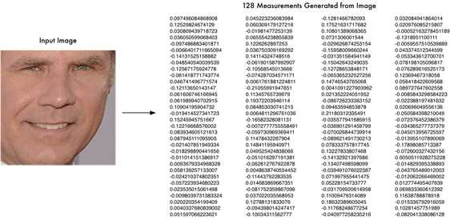

这些是由神经网络产生的面部特征测量值，训练后的该神经网络可以保证不同的数字代表了不同人的面部。

这是我们的**编码**。它让我们用简单的东西（128 个数字）代表非常复杂的东西（一张脸的图片）。现在比较两张脸更加容易了，因为我们只需要比较这 128 个数字而不是比较整张脸的图像。

你猜怎么着？我们可以用句子做同样的事情！我们可以把任何一个句子表达成一系列独特的编码：

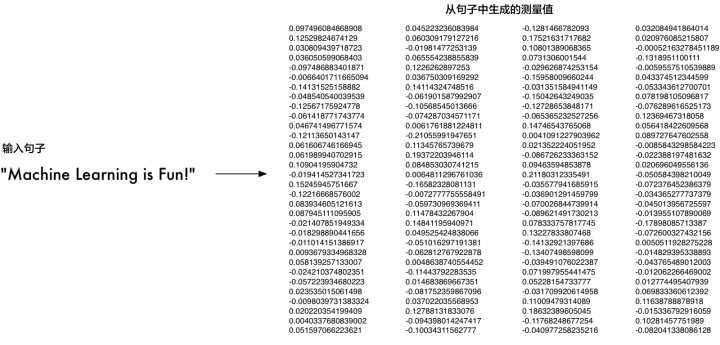

这一序列数字代表的是英语句子「有趣的机器学习！」。不同的句子将由不同的数字集表示。

为了生成这个编码，我们将句子输入到 RNN 中，一次一个词。最后一个词处理之后的最终结果，就将是表示整个句子的数值：

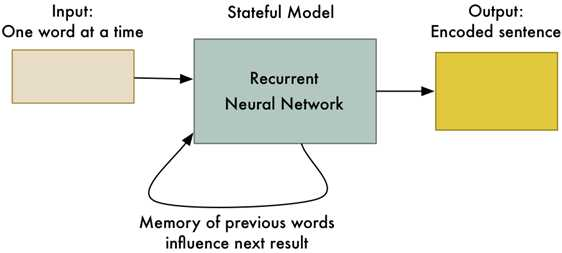

因为RNN具有记忆功能，能够记住处理过的每个词，所以它计算的最终编码表示句子中的所有词。

棒极了，所以现在我们有一种方法来把一个整个句子表示成一组独特的数字！虽然我们不知道编码中的每个数字是什么意思，但这并不重要。只要每一句话都能由一组独特的数字标识出来，那么我们就不需要准确地知道这些数字是如何生成的。

**让我们开始翻译吧！**

好的，所以我们知道怎样使用 RNN 去给一句话编码，并生成一组独特的数字了。它有什么用呢？事情从这儿开始变得酷炫了！

如果我们使用两个 RNN 并将它们首尾相连呢？第一个 RNN 可以给句子生成编码。然后，第二 RNN 遵循相反的逻辑，解码得到原始句子：

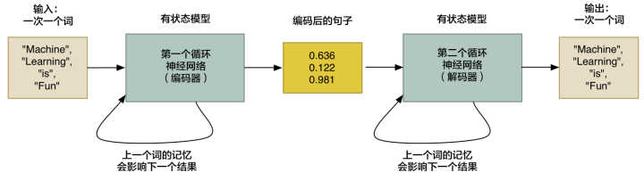

当然，编码然后再解码并得到原始语句并没有太大用处。但是如果（**这里是问题的关键**），我们训练第二个 RNN，使它解码成西班牙语而不是英语，这会怎样？我们可以使用平行语料库训练数据来训练它：

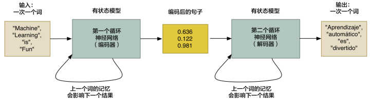

就像这样，我们有一个通用的方法，将一序列英语单词转换成同样的西班牙语单词序列！

这是一个强有力的想法：

· 这种方法主要受限于你拥有的训练数据量和你可以投入的计算机生产力。机器学习研究人员仅仅在**两年前**发明了这个方法，但它已经表现得和统计机器翻译系统一样好了，而后者花了**20年时间**才开发完善。

· 这不依赖于任何关于人类语言规则的了解。算法自己计算出这些规则。这意味着你不需要专业人士来调整翻译流水线的各个步骤，计算机为你把这个做好了。

· 这种方法适用于几乎任何种类的**序列到序列**（sequence-to-sequence）问题！而且事实证明，许多有趣的问题实际上都是序列到序列的问题。继续阅读，了解其他你可以做的酷炫的事！

注意，我们忽略了一些处理真实数据时会碰到的问题。例如，如何处理不同长度的输入和输出？这还需要一些额外的工作（请[参见 bucketing 和 padding](http://link.zhihu.com/?target=https%3A//www.tensorflow.org/versions/r0.10/tutorials/seq2seq/index.html%23bucketing-and-padding)）。[非常用词翻译](http://link.zhihu.com/?target=https%3A//cs224d.stanford.edu/papers/addressing.pdf)也是一个问题。

**构建你自己的序列到序列翻译系统**

如果你想建立自己的语言翻译系统，这儿有一个包括可以在英语和法语之间翻译的[TensorFlow demo](http://link.zhihu.com/?target=https%3A//www.tensorflow.org/versions/r0.10/tutorials/seq2seq/index.html)。然而，这并不是给怕麻烦或预算有限的人准备的。这仍然是一项新技术，并且很吃资源。即使你有一台带有高级显卡的高级电脑，可能也需要连续一个月的时间来训练你自己的语言翻译系统。

此外，序列到序列语言翻译技术正在及快速地改进，以至于我们难以跟上最新技术。许多最近的改进（如添加[注意机制](http://link.zhihu.com/?target=http%3A//stanford.edu/%7Elmthang/data/papers/emnlp15_attn.pdf)或[语境追踪](http://link.zhihu.com/?target=http%3A//arxiv.org/abs/1607.00578)）显著改善了翻译结果，但这些发展太过前沿，以至于它们甚至还没有维基百科页面。如果你想认真研究序列到序列学习，你必须随时跟进最新的技术发展。

## 序列到序列模型的无穷力量

那么，我们还能用序列到序列模型做什么呢？

大约一年前，[Google 的研究人员表示](http://link.zhihu.com/?target=https%3A//arxiv.org/pdf/1506.05869.pdf)，你可以使用序列到序列模型来建造 AI 机器人。这个想法是如此简单，并且令人震惊的是，它真的有效。

首先，他们获取了一些 Google 员工和 Google 技术支持小组之间的聊天记录。然后他们训练了序列到序列模型，其中输入的句子就是员工的问题，而技术支持团队的回复是该句子的「翻译」。

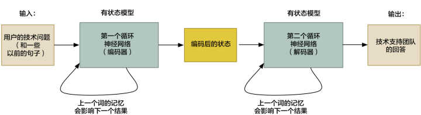

当用户与机器人进行交互时，他们将使用该系统「翻译」每个用户的消息以获得机器人的响应。

他们最终得到的是一个半智能机器人，（有时）可以回答真正的技术支持问题。下面是一部分用户和机器人之间的对话示例，截取自[他们的论文](http://link.zhihu.com/?target=https%3A//arxiv.org/pdf/1506.05869.pdf)：

> 人：连接被拒绝或类似的东西
>
> 机器：我可以知道你连接的网络连接的版本吗？
>
> 人：我不确定我知不知道
>
> 机器：是网络连接提示任何用户证书？
>
> 人类：是的
>
> 机器：你现在在家还是在工作？办公室？
>
> 人：我在家
>
> 机器：试试这个。 去这个页面 &lt;URL已省略&gt;，然后输入您的姓名和密码
>
> 人类：完成
>
> 机器：尝试使用&lt;用户名已省略&gt;登录，然后检查其是否正常工作
>
> 人类：是的，现在正常了！
>
> 机器：棒极了。还有什么我可以帮助你的？

  

他们还试图建立一个基于数百万部电影字幕的聊天机器人。他们的想法是，使用电影角色之间的对话作为一种训练机器人像人一样说话的方式。输入句子是一名角色的一句话，「翻译」是另一名角色的回复：

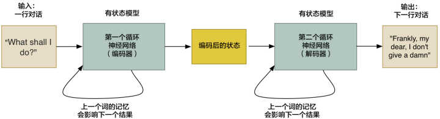

他们得到了很有意思的结果。机器人不仅仅像一个人，更是显示出了一点点智能化：

> 人类：我的名字是大卫。我的名字是什么？
>
> 机器：大卫。
>
> 人：我的名字是约翰。我的名字是什么？
>
> 机器：约翰。
>
> 人类：你是领导者还是追随者？
>
> 机器：我是领导者。
>
> 人类：你是追随者还是领导者？
>
> 机器：我是领导者。

  

这只是可能性的开始。我们不局限于句子之间的转换。同样，我们制作一个图像到序列的模型，它可以将图像转换为文本！

[Google 的另一个团队](http://link.zhihu.com/?target=http%3A//www.cv-foundation.org/openaccess/content_cvpr_2015/papers/Vinyals_Show_and_Tell_2015_CVPR_paper.pdf)通过将第一个 RNN 替换为卷积神经网络（如我们在第三章中所了解的那样）。这允许输入是图片而不是句子，其余的工作基本相同：

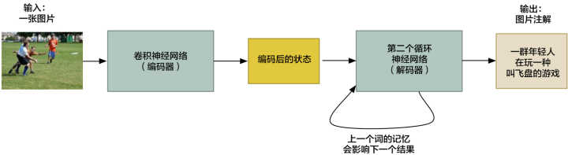

就像这样，（只要我们有很多很多的训练数据）我们就可以把图片变成单词！

[安德烈·卡帕西](http://link.zhihu.com/?target=http%3A//cs.stanford.edu/people/karpathy/)把这个想法[进行了拓展](http://link.zhihu.com/?target=http%3A//cs.stanford.edu/people/karpathy/cvpr2015.pdf)，构建了一个通过分别处理图像的多个区域，来详细描述图像的系统：

图片来自[安德烈·卡帕西](http://link.zhihu.com/?target=http%3A//cs.stanford.edu/people/karpathy/)的[这篇论文](http://link.zhihu.com/?target=http%3A//cs.stanford.edu/people/karpathy/cvpr2015.pdf)

这个想法使得我们可以构建一个，能够按照奇怪的要求找到特定图片的[图片搜索引擎](http://link.zhihu.com/?target=http%3A//cs.stanford.edu/people/karpathy/deepimagesent/rankingdemo/)：

例子来自[image sentence ranking visualize](http://link.zhihu.com/?target=http%3A//cs.stanford.edu/people/karpathy/deepimagesent/rankingdemo/)

甚至有研究人员[正在研究相反的问题](http://link.zhihu.com/?target=http%3A//arxiv.org/pdf/1506.03500.pdf)，仅仅基于文本描述生成一个完整的图片！

从这些例子，你可以开始想象各种可能性。 到目前为止，序列到序列已经应用在[从语音识别到计算机视觉各个领域](http://link.zhihu.com/?target=https%3A//github.com/kjw0612/awesome-rnn%23applications)。 我猜，明年会有更多的应用。

如果您想更深入地了解序列到序列模型和翻译，以下是一些推荐的资源：

* [Richard Socher’s CS224D Lecture— Fancy Recurrent Neural Networks for Machine Translation](http://link.zhihu.com/?target=https%3A//www.youtube.com/watch%3Fv%3DqGlmW2n4s1w)
  （视频）
 
* [Thang Luong’s CS224D Lecture — Neural Machine Transation](http://link.zhihu.com/?target=http%3A//cs224d.stanford.edu/lectures/CS224d-Lecture15.pdf)
  （PDF）
 
* [TensorFlow’s description of Seq2Seq modeling](http://link.zhihu.com/?target=https%3A//www.tensorflow.org/versions/r0.10/tutorials/seq2seq/index.html)
 
* [The Deep Learning Book’s chapter on Sequence to Sequence Learning](http://link.zhihu.com/?target=http%3A//www.deeplearningbook.org/contents/rnn.html)
  （PDF）
 

  

1. 译者注：罗塞塔石碑，高 1.14 米，宽 0.73 米，制作于公元前 196年，刻有[古埃及](http://link.zhihu.com/?target=http%3A//baike.baidu.com/view/8498.htm)国王[托勒密五世](http://link.zhihu.com/?target=http%3A//baike.baidu.com/view/192409.htm)登基的诏书。石碑上用[希腊文字](http://link.zhihu.com/?target=http%3A//baike.baidu.com/view/11761660.htm)、[古埃及文字](http://link.zhihu.com/?target=http%3A//baike.baidu.com/view/138248.htm)和当时的通俗体文字刻了同样的内容，这使得近代的[考古学家](http://link.zhihu.com/?target=http%3A//baike.baidu.com/view/67249.htm)得以有机会对照各语言版本的内容后，解读出已经失传千余年的埃及象形文之意义与结构，而成为今日研究古埃及历史的重要里程碑。

